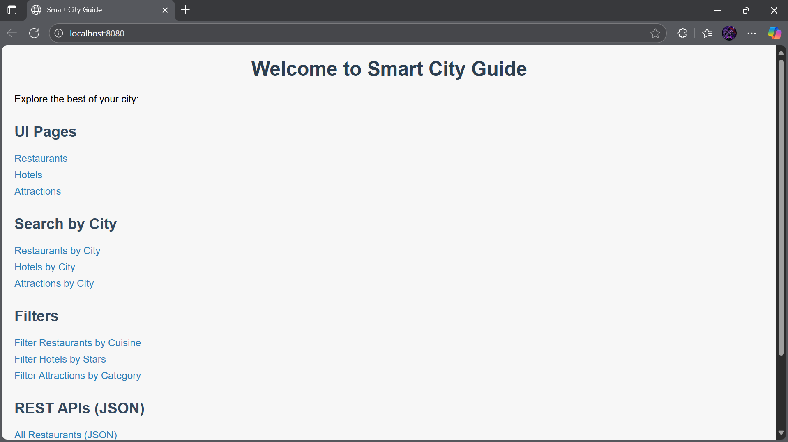
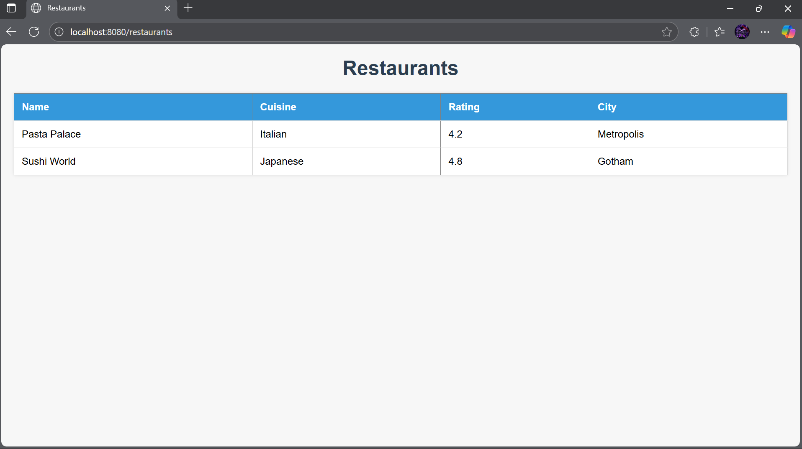
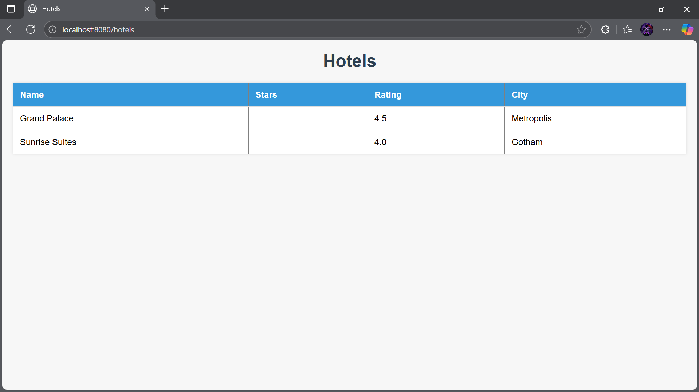
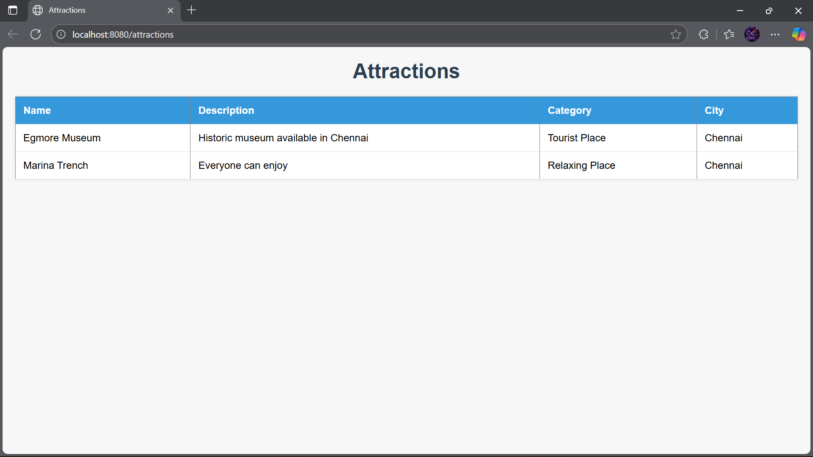

# Smart City Guide

Welcome to the **Smart City Guide** repository!  
This project provides an interactive platform for exploring city locations, services, and attractions. It is built with Java (backend and logic), HTML (structure), and CSS (styling). 

---

## Table of Contents

- [Features](#features)
- [Tech Stack](#tech-stack)
- [Screenshots](#screenshots)
- [Getting Started](#getting-started)
- [Usage](#usage)
- [Project Structure](#project-structure)
- [Contributing](#contributing)
- [License](#license)
- [Contact](#contact)

---

## Features

- Explore city landmarks, restaurants, hospitals, and other services.
- Interactive and user-friendly interface.
- Search and filter locations by category and rating.
- Easily extensible to add new places or features.

---

## Tech Stack

- **Java** (67%) – Core logic, backend
- **HTML** (25.5%) – Frontend structure
- **CSS** (7.5%) – Styling and layout

---

## Sample Screenshots




---

## Getting Started

### Prerequisites

- Java 8 or later
- IDE (IntelliJ, Eclipse, etc.)
- Web browser (for HTML/CSS)

### Installation

1. **Clone the repository:**
   ```bash
   git clone https://github.com/Yoge-2004/smart-city-guide.git
   ```
2. **Open the project in your IDE.**
3. **Build the project** to resolve dependencies and compile sources.

### Running

- For Java GUI: Locate and run the main class (`SmartCityGuideApplication.java`).
- For HTML/CSS preview: Open HTML files in your browser.

---

## Usage

- Use the interface to explore city features.
- Search and filter locations based on your interest.
- See screenshots in the `images` folder for a visual guide.

---

## Project Structure

```
smart-city-guide/
│
├── src/           # Java source files
├── web/           # HTML and CSS files
├── images/        # Screenshots of the application
├── README.md      # Documentation
└── ...            # Other files/resources
```

---

## Contributing

Contributions are welcome!

1. Fork the repository.
2. Create a new branch (`git checkout -b feature-name`).
3. Commit your changes.
4. Open a pull request with a description.

---

## License

This project is licensed under the [MIT License](LICENSE).

---

## Contact

Author: [Yoge-2004](https://github.com/Yoge-2004)  
For feedback or questions, open an issue or contact via GitHub.

---

*Enjoy exploring your Smart City!*
